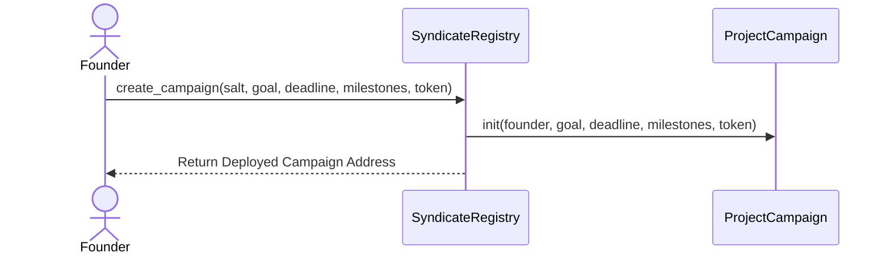

# SeedChain: Milestone-Gated Escrow Syndicate

SeedChain is a decentralized crowdfunding and startup investment syndicate platform built on the Stellar network using Soroban smart contracts. It resolves founder default risks and builds investor trust by locking raised capital in escrows, released incrementally in blocks only after verified progress milestones are approved by backer consensus voting.

---

## 🔗 Submission References (Level 3 Submission)

* **GitHub Repository:** [mrdd-coder/Seed-Chain](https://github.com/mrdd-coder/Seed-Chain)
* **Live Demo URL:** *[INSERT YOUR LIVE DEMO LINK HERE (Vercel/Netlify)]*
* **Walkthrough Demo Video:** *[INSERT YOUR 1-2 MINUTE WALKTHROUGH VIDEO LINK HERE (Loom/Drive/YouTube)]*

### Deployed Contract Config (Stellar Testnet)
* **SyndicateRegistry Address:** `CBNRSQKD43UXRUQWEZHC46HITIAVZPKIO6U4TH6TCFLSOKCGHUXABLVU`
* **ProjectCampaign WASM Hash:** `6da2c33188a6ce9fa687b31f7b7e2a3b401624205abfd788eec29eeda20f13cf`
* **Platform Fee Collector:** `GBEDWS2NFV5DO4Z44VRT4BCEJIFCURWPQFCQFFJRNLDB7GIOX2Y7RSBX`

### Verified On-Chain Transactions
* **Install SyndicateRegistry WASM:** [914bbb8e022f7524ece5283e3324a21cb4fa6d97d7dbb65f28f21c26f0e33038](https://stellar.expert/explorer/testnet/tx/914bbb8e022f7524ece5283e3324a21cb4fa6d97d7dbb65f28f21c26f0e33038)
* **Deploy Registry Instance:** [7ef33b0c7ecee99481f010ac76e6e6f1da196d964d14527c5e5040486d71538b](https://stellar.expert/explorer/testnet/tx/7ef33b0c7ecee99481f010ac76e6e6f1da196d964d14527c5e5040486d71538b)
* **Initialize Registry Params:** [eaf01c6f09b64a60d82f5ffa23e8b2aacb13234f7c42c07ea978254b4c739c7b](https://stellar.expert/explorer/testnet/tx/eaf01c6f09b64a60d82f5ffa23e8b2aacb13234f7c42c07ea978254b4c739c7b)
* **Set Deployed Campaign WASM Hash:** [a1e5d5d8cc6ffb22fac77ae2f71f61575c13f0a1493aed174dafb3a61f97d103](https://stellar.expert/explorer/testnet/tx/a1e5d5d8cc6ffb22fac77ae2f71f61575c13f0a1493aed174dafb3a61f97d103)

---

## 🛠️ Technical Stack

* **Rust Soroban SDK (v21.7.7):** Advanced multi-milestone contract architecture, storage TTL preservation, state control, and factory-pattern instantiation.
* **Next.js 15 (App Router):** Fast, SEO-optimized, React Server Component routing.
* **Zustand:** Decentralized global state store for active wallet sessions and transaction status tracking.
* **StellarWalletsKit:** Freighter and Albedo wallet connectors.
* **Recharts:** Live metrics analytics graphs.
* **Tailwind CSS & custom Web3 styling:** Custom purple-to-indigo mesh gradients, glassmorphism, responsive cards, and spotlights.

---

## 📂 Project Architecture

```
SeedChain/
├── .cargo/
│   └── config.toml               # Cargo target linker overrides
├── .github/
│   └── workflows/
│       └── ci-cd.yml             # GitHub Actions CI/CD pipeline
├── contracts/
│   ├── campaign/
│   │   ├── src/
│   │   │   ├── lib.rs            # ProjectCampaign source contract
│   │   │   └── test.rs           # Campaign milestone unit tests
│   └── syndicate/
│       ├── src/
│       │   ├── lib.rs            # SyndicateRegistry source contract
│       │   └── test.rs           # Registry deployment tests
├── frontend/
│   ├── src/
│   │   ├── __tests__/
│   │   │   ├── dashboard.test.tsx # Personal dashboard unit tests
│   │   │   └── campaigns.test.tsx # Campaign explorer unit tests
│   │   ├── app/
│   │   │   ├── campaigns/
│   │   │   │   └── page.tsx      # Explore and launch campaigns
│   │   │   ├── dashboard/
│   │   │   │   └── page.tsx      # Portfolio overview
│   │   │   ├── how-it-works/
│   │   │   │   └── page.tsx      # Onboarding guide
│   │   │   ├── activity/
│   │   │   │   └── page.tsx      # Real-time event streaming feed
│   │   │   └── transactions/
│   │   │       └── page.tsx      # Tx Center & Send XLM Panel
│   │   ├── components/
│   │   │   └── Navbar.tsx        # Responsive navigation & wallet link
│   │   └── services/
│   │       └── stellar.ts        # Soroban RPC client services
└── scripts/
    ├── deploy.ps1                # PowerShell Testnet compiler & deployment script
    └── deploy.sh                 # Shell Testnet deployment script
```

---

## ⚙️ Advanced Smart Contract Mechanics

### 1. Inter-Contract Call Flow (Factory Pattern)
The `SyndicateRegistry` contract functions as a factory. It takes the target startup configuration, deployer parameters, and milestones array, installs a unique `ProjectCampaign` instance deterministically using a salt, and initializes the campaign.



### 2. State Rent Preservation (TTL Management)
To prevent contracts and keys from getting archived on-chain, all contract functions read/write values using explicit Instance and Persistent storage TTL extension calls:
* `env.storage().instance().extend_ttl(1000, 10000)`
* `env.storage().persistent().extend_ttl(key, 1000, 10000)`

### 3. Refund Voter Safeguards
If a founder defaults or misses project timelines, backers can invoke `vote_for_refund()`. Once voting thresholds are exceeded, the contract locks, disables founder payouts, and backers can withdraw their proportional USDC from the remaining escrow.

---

## 🚀 Local Installation & Execution

### 1. Rust Contracts
Compile the Rust code to WASM targets and run smart contract tests:
```bash
# Clean target
cargo clean

# Build contracts
cargo build --target wasm32-unknown-unknown --release

# Run Rust unit tests
cargo test
```

### 2. Next.js Frontend
Verify frontend test assertions, compile the static optimization bundle, and launch the dev environment:
```bash
cd frontend

# Install package dependencies
npm install --ignore-scripts --legacy-peer-deps

# Run Vitest unit tests
npm run test -- --run

# Compile production build
npm run build

# Run local development server
npm run dev
```

---

## 📷 Submission Media & Proof (Level 3 Verification)

### Deployed Testnet Transactions (from level 2)
<table width="100%">
  <tr>
    <td width="50%" align="center" valign="top">
      <h4>Transaction 1</h4>
      
    </td>
    <td width="50%" align="center" valign="top">
      <h4>Transaction 2</h4>
      
    </td>
  </tr>
</table>

### Wallet Options Available (Freighter & Albedo modal)
*[INSERT YOUR SCREENSHOT OF WALLET CONNECT POPUP HERE]*

### Mobile Responsive UI
*[INSERT YOUR SCREENSHOT OF MOBILE RESPONSIVE DASHBOARD LAYOUT HERE]*

### CI/CD Pipeline Running (GitHub Actions Checks)
*[INSERT YOUR SCREENSHOT OF THE GITHUB ACTIONS TAB SHOWING PASSING RUN CHECKS HERE]*

### Test Output (Passing Rust & Frontend Vitest tests)
*[INSERT YOUR SCREENSHOT OF CARGO TEST AND VITEST PASSED OUTPUT TERMINALS HERE]*
