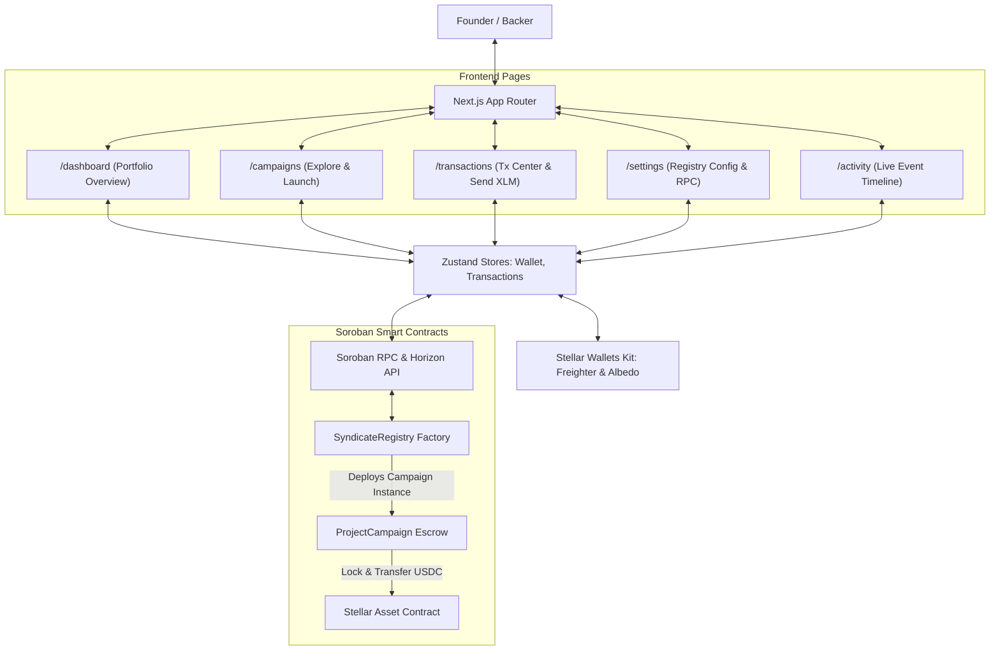
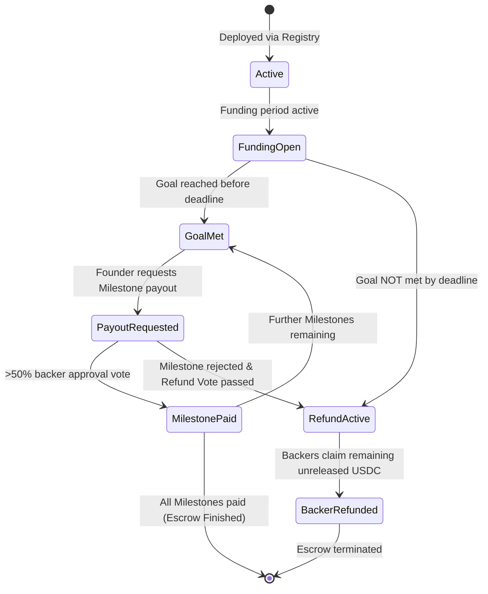
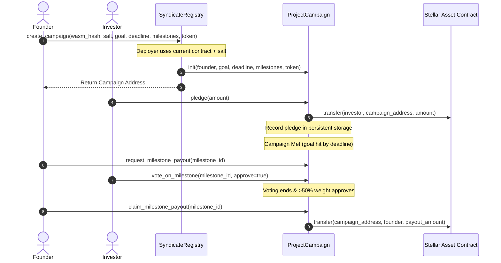

<h1 align="center">🌱 SeedChain Syndicate 🔗</h1>

<p align="center">
  <strong>A Decentralized Startup Investment Syndicate Platform built on the Stellar network using Soroban smart contracts.</strong>
</p>

<p align="center">
  <a href="https://seedchain-rho.vercel.app/" target="_blank">
    
  </a>
</p>

<p align="center">
  <a href="https://github.com/mrdd-coder/Seed-Chain/actions/workflows/ci-cd.yml" target="_blank">
    
  </a>
</p>

<p align="center">
  <a href="#overview">Overview</a> •
  <a href="#tech-stack">Tech Stack</a> •
  <a href="#architecture">Architecture</a> •
  <a href="#development">Development</a> •
  <a href="#deployment-guide">Deployment Guide</a> •
  <a href="#screenshots">Screenshots</a>
</p>

---

* **GitHub Repository:** [mrdd-coder/Seed-Chain](https://github.com/mrdd-coder/Seed-Chain)
* **Walkthrough Demo Video:** 

https://github.com/user-attachments/assets/fab799f8-768d-473e-8c0b-ef0ba81c863c


---

## 📌 Table of Contents

* [1. Product Overview & Problem Statement](#overview)
  * [The Problem](#the-problem)
  * [The SeedChain Solution](#the-seedchain-solution)
* [2. Technical Stack](#tech-stack)
* [3. Directory Structure](#directory-structure)
* [4. Technical Architecture & Component Flow](#architecture)
  * [1. System Component Architecture](#component-architecture)
  * [2. Escrow Campaign Lifecycle State Transitions](#state-transitions)
  * [3. Inter-Contract Communication Flow](#communication-flow)
* [5. Smart Contract Design](#contract-design)
  * [Data Storage & TTL Preservation](#ttl-preservation)
  * [Access Control](#access-control)
* [6. Local Development & Testing](#development)
  * [Prerequisites](#prerequisites)
  * [Compilation & Testing](#compilation-testing)
  * [Frontend Development](#frontend-dev)
* [7. Stellar Testnet Deployment Guide](#deployment-guide)
  * [Step 1: Configure Deployer Identity](#deployer-identity)
  * [Step 2: Compile WASM Bytecodes](#compile-wasm)
  * [Step 3: Install Bytecodes to Testnet](#install-bytecodes)
  * [Step 4: Deploy the Syndicate Registry](#deploy-registry)
  * [Step 5: Initialize the Syndicate Registry](#initialize-registry)
  * [Step 6: Configure Frontend](#configure-frontend)
* [8. Syndicate Configuration Log & Verification](#verification)
  * [On-Chain Contract Verification Links](#verification-links)
* [9. Security Considerations](#security)
* [10. Project Media & Screenshots](#screenshots)

---

<a name="overview"></a>
## 🔍 1. Product Overview & Problem Statement

<a name="the-problem"></a>
### The Problem
Traditional startup crowdfunding platforms (and standard Web3 launchpads) suffer from a lack of accountability and trust:
1. **Front-Loaded Risk:** Founders receive 100% of raised capital immediately. If they default, mismanage funds, or abandon the project, investors lose everything.
2. **No Investor Recourse:** Investors have no governance control over how funds are spent after the raise finishes.
3. **High Fee Overhead:** Intermediaries charge massive listing and escrow fees to manage startup syndicates.

<a name="the-seedchain-solution"></a>
### The SeedChain Solution
SeedChain introduces **Milestone Crowd Escrows** via Soroban smart contracts:
* **Factory Architecture:** A central registry deploys isolated escrow contracts for each startup project.
* **Milestone-Gated Releases:** Funds are disbursed in waves (e.g., 30% on MVP, 40% on alpha launch, 30% on public release).
* **Syndicate Governance:** Founders request milestone payouts, and investors vote with weights proportional to their pledge size. Payouts require >50% approval.
* **On-Chain Refund Trigger:** If a founder defaults or fails to deliver, investors can vote to trigger a proportional refund of the remaining escrow.

---

<a name="tech-stack"></a>
## 🛠️ 2. Technical Stack

* **Smart Contracts:** Rust, Soroban SDK (v21.7.7)
* **Frontend:** Next.js 15 (App Router), TypeScript, Tailwind CSS, shadcn/ui
* **State Management:** Zustand (wallet session persistence, transaction logs)
* **Data Querying:** React Query (RPC state synchronization)
* **Wallet Connection:** StellarWalletsKit SDK (Freighter / Albedo)
* **Charts & Data Visuals:** Recharts
* **Tailwind CSS & custom Web3 styling:** Custom purple-to-indigo mesh gradients, glassmorphism, responsive cards, and spotlights.

---

<a name="directory-structure"></a>
## 📂 3. Directory Structure

The project has been organized with a feature-based architecture separating smart contracts, deployment tools, and the Next.js frontend app:

```
SeedChain/
├── .cargo/
│   └── config.toml               # Cargo target linker overrides
├── .github/
│   └── workflows/
│       └── ci-cd.yml             # GitHub Actions CI/CD pipeline
├── contracts/
│   ├── campaign/
│   │   ├── src/
│   │   │   ├── lib.rs            # ProjectCampaign contract source
│   │   │   └── test.rs           # Campaign contract unit tests
│   │   └── Cargo.toml            # Campaign contract configuration
│   └── syndicate/
│       ├── src/
│       │   ├── lib.rs            # SyndicateRegistry contract source
│       │   └── test.rs           # Syndicate registry unit tests
│       └── Cargo.toml            # Syndicate contract configuration
├── frontend/
│   ├── src/
│   │   ├── __tests__/
│   │   │   ├── frontend.test.tsx # Vitest frontend test suite
│   │   │   ├── dashboard.test.tsx # Personal dashboard unit tests
│   │   │   └── campaigns.test.tsx # Campaign explorer unit tests
│   │   ├── app/
│   │   │   ├── activity/
│   │   │   │   └── page.tsx      # Real-time event activity feed
│   │   │   ├── analytics/
│   │   │   │   └── page.tsx      # Recharts dashboard analytics
│   │   │   ├── campaigns/
│   │   │   │   └── page.tsx      # Campaigns browse, launch & search page
│   │   │   ├── dashboard/
│   │   │   │   └── page.tsx      # Personal portfolio dashboard
│   │   │   ├── how-it-works/
│   │   │   │   └── page.tsx      # Step-by-step onboarding guide
│   │   │   ├── settings/
│   │   │   │   └── page.tsx      # RPC and network configurations
│   │   │   ├── transactions/
│   │   │   │   └── page.tsx      # Transaction center and Send XLM panel
│   │   │   ├── globals.css       # Tailwind CSS v4 styling configurations
│   │   │   ├── layout.tsx        # Next.js root layout loading google fonts
│   │   │   └── page.tsx          # Marketing landing page
│   │   ├── components/
│   │   │   └── Navbar.tsx        # StellarWalletsKit navigation and wallet connect
│   │   └── services/
│   │       └── stellar.ts        # Soroban RPC client and transaction helper
└── scripts/
    ├── deploy.ps1                # PowerShell Stellar testnet deployment automation
    └── deploy.sh                 # Bash shell testnet deployment automation
```

---

<a name="architecture"></a>
## 📐 4. Technical Architecture & Component Flow

<a name="component-architecture"></a>
### 1. System Component Architecture
SeedChain uses a modern Next.js multi-route architecture separated by domain concerns. User requests are handled by specific pages that synchronize with Zustand stores for Freighter/Albedo wallet sessions and RPC event logs.



<a name="state-transitions"></a>
### 2. Escrow Campaign Lifecycle State Transitions
Syndicate campaign escrows transition through deterministic states governed on-chain by investor voting and deadline blocks:



<a name="communication-flow"></a>
### 3. Inter-Contract Communication Flow
The platform relies on contract-to-contract calls. The `SyndicateRegistry` installs the `ProjectCampaign` WASM and dynamically instantiates campaigns deterministically based on salt, then initializes them:



---

<a name="contract-design"></a>
## 🔒 5. Smart Contract Design

The contracts are built in Rust using the official **Soroban Rust SDK**:

<a name="ttl-preservation"></a>
### Data Storage & TTL Preservation
To protect against State Archival fees on Stellar, we use a hybrid storage design:
1. **Instance Storage:** Small configuration items (admin address, WASM hash, campaign lists, platform fees) are stored in the contract instance. We call `env.storage().instance().extend_ttl(1000, 10000)` inside frequently accessed functions to ensure the contract instance does not expire.
2. **Persistent Storage:** Medium-term variables (investor pledges, milestone voting states) are stored in persistent storage. Each write/read invokes `env.storage().persistent().extend_ttl(key, 1000, 10000)` to preserve user state.

<a name="access-control"></a>
### Access Control
We enforce strict role-based authorization:
* `require_auth()` is called on user addresses (founders, investors) to verify signatures.
* Only the `Admin` of the `SyndicateRegistry` can set fees, register WASM, or execute contract upgrades.
* Only the `Founder` of a `ProjectCampaign` can request milestone disbursements.

---

<a name="development"></a>
## 💻 6. Local Development & Testing

<a name="prerequisites"></a>
### Prerequisites
* Node.js (v20+ recommended)
* Rust and Cargo (v1.81+)
* Target: `rustup target add wasm32-unknown-unknown`
* Target: `rustup target add wasm32v1-none`

<a name="compilation-testing"></a>
### Compilation & Testing

1. **Clean Workspace:**
   ```bash
   cargo clean
   ```
2. **Build Smart Contracts:**
   ```bash
   cargo build --target wasm32-unknown-unknown --release
   ```
3. **Run Smart Contract Unit Tests:**
   ```bash
   cargo test
   ```

<a name="frontend-dev"></a>
### Frontend Development

1. **Navigate to Frontend:**
   ```bash
   cd frontend
   ```
2. **Install Dependencies:**
   ```bash
   npm install --ignore-scripts --legacy-peer-deps
   ```
3. **Run Development Server:**
   ```bash
   npm run dev
   ```
   Open [http://localhost:3000](http://localhost:3000) to view the client dashboard.
4. **Run Frontend Tests:**
   ```bash
   npm run test
   ```

---

<a name="deployment-guide"></a>
## 🚀 7. Stellar Testnet Deployment Guide

Follow these exact steps to compile and deploy the SeedChain syndicate to the **Stellar Testnet**:

<a name="deployer-identity"></a>
### Step 1: Configure Deployer Identity
Generate a deployment identity inside the Stellar CLI and request test tokens from the friendbot:
```bash
# Generate key pair
stellar keys generate deployer --network testnet --fund
 
# Get public key address
stellar keys address deployer
```

<a name="compile-wasm"></a>
### Step 2: Compile WASM Bytecodes
```bash
stellar contract build
```

<a name="install-bytecodes"></a>
### Step 3: Install Bytecodes to Testnet
Upload both WASM packages to the network. Take note of the resulting WASM hashes:
```bash
# Upload Campaign contract
stellar contract install --wasm ./target/wasm32v1-none/release/seedchain_campaign.wasm --source deployer --network testnet
 
# Upload Syndicate Registry contract
stellar contract install --wasm ./target/wasm32v1-none/release/seedchain_syndicate.wasm --source deployer --network testnet
```

<a name="deploy-registry"></a>
### Step 4: Deploy the Syndicate Registry
Deploy the registry instance. Replace `<REGISTRY_WASM_HASH>` with the hash returned in the previous step:
```bash
stellar contract deploy --wasm-hash <REGISTRY_WASM_HASH> --source deployer --network testnet --salt "0000000000000000000000000000000000000000000000000000000000000001"
```
This returns the active **Registry Contract Address** (e.g., `CDRegistryAddress...`).

<a name="initialize-registry"></a>
### Step 5: Initialize the Syndicate Registry
Initialize the registry by setting the administrator and setting the campaign WASM template hash:
```bash
# Initialize registry admin
stellar contract invoke --id <REGISTRY_CONTRACT_ADDRESS> --source deployer --network testnet -- init --admin <DEPLOYER_ADDRESS>
 
# Configure campaign WASM hash
stellar contract invoke --id <REGISTRY_CONTRACT_ADDRESS> --source deployer --network testnet -- set_campaign_wasm --wasm_hash <CAMPAIGN_WASM_HASH>
```

<a name="configure-frontend"></a>
### Step 6: Configure Frontend
Create `frontend/src/contracts-metadata.json` and paste your deployed contract details:
```json
{
  "network": "testnet",
  "rpcUrl": "https://soroban-testnet.stellar.org",
  "registryAddress": "CDRegistryAddress...",
  "campaignWasmHash": "CAMPAIGN_WASM_HASH...",
  "deployerAddress": "GDeployerAddress...",
  "timestamp": "2026-06-27 12:00:00"
}
```

---

<a name="verification"></a>
## 📋 8. Syndicate Configuration Log & Verification

Update this log after your testnet deployment:

| Contract Component | Stellar Testnet Address / Hash |
| --- | --- |
| **SyndicateRegistry Contract** | `CBNRSQKD43UXRUQWEZHC46HITIAVZPKIO6U4TH6TCFLSOKCGHUXABLVU` |
| **ProjectCampaign WASM Hash** | `6da2c33188a6ce9fa687b31f7b7e2a3b401624205abfd788eec29eeda20f13cf` |
| **USDC Testnet Token** | `Native / Test stablecoin compatibility` |
| **Platform Administrator** | `GBEDWS2NFV5DO4Z44VRT4BCEJIFCURWPQFCQFFJRNLDB7GIOX2Y7RSBX` |

<a name="verification-links"></a>
### On-Chain Contract Verification Links
All registry setup steps were executed on-chain via the `charlie` key pair. You can verify these operations on the Stellar Explorer:
* **Contract Upload (SyndicateRegistry WASM):** [Tx 914bbb8e...](https://stellar.expert/explorer/testnet/tx/914bbb8e022f7524ece5283e3324a21cb4fa6d97d7dbb65f28f21c26f0e33038)
* **Contract Deployment (SyndicateRegistry Instance):** [Tx 7ef33b0c...](https://stellar.expert/explorer/testnet/tx/7ef33b0c7ecee99481f010ac76e6e6f1da196d964d14527c5e5040486d71538b)
* **Contract Call (Initialize Registry):** [Tx eaf01c6f...](https://stellar.expert/explorer/testnet/tx/eaf01c6f09b64a60d82f5ffa23e8b2aacb13234f7c42c07ea978254b4c739c7b)
* **Contract Call (Configure Campaign WASM Hash):** [Tx a1e5d5d8...](https://stellar.expert/explorer/testnet/tx/a1e5d5d8cc6ffb22fac77ae2f71f61575c13f0a1493aed174dafb3a61f97d103)

---

<a name="security"></a>
## 🛡️ 9. Security Considerations

1. **Reentrancy Protection:** All token transfers (`transfer()`) are placed at the end of execution blocks after internal state updates (pledges cleared, milestones marked paid) to prevent reentrancy exploits.
2. **Access Safeguards:** Sensitive operations (`claim_milestone_payout`, `request_milestone_payout`, `upgrade`) explicitly require administrative or target founder authorization.
3. **State Rent Prevention:** `extend_ttl` is integrated across all read/write paths in persistent and instance storage to prevent state expiration.

---

<a name="screenshots"></a>
## 📷 Project Media & Screenshots

### Desktop Web Application Interface

<table width="100%">
  <tr>
    <td width="50%" align="center" valign="top">
      <strong>🏠 Landing Homepage</strong><br/>
      
    </td>
    <td width="50%" align="center" valign="top">
      <strong>📊 Investor Dashboard</strong><br/>
      
    </td>
  </tr>
  <tr>
    <td width="50%" align="center" valign="top">
      <strong>🔍 Browse Campaigns</strong><br/>
      
    </td>
    <td width="50%" align="center" valign="top">
      <strong>🚀 Launch Campaign</strong><br/>
      
    </td>
  </tr>
  <tr>
    <td width="50%" align="center" valign="top">
      <strong>💸 Transaction Center</strong><br/>
      
    </td>
    <td width="50%" align="center" valign="top">
      <strong>⚙️ Platform Settings</strong><br/>
      
    </td>
  </tr>
</table>
### Deployed Testnet Transactions
<table width="100%">
  <tr>
    <td width="50%" align="center" valign="top">
      <h4>Transaction 1</h4>
      
    </td>
    <td width="50%" align="center" valign="top">
      <h4>Transaction 2</h4>
      
    </td>
  </tr>
</table>

### Wallet Options Available (Freighter & Albedo modal)


### Mobile Responsive UI


### CI/CD Pipeline Running (GitHub Actions Checks)


### Test Output (Passing Rust & Frontend Vitest tests)


<!-- SeedChain Syndicate - Deployed & Verified -->
